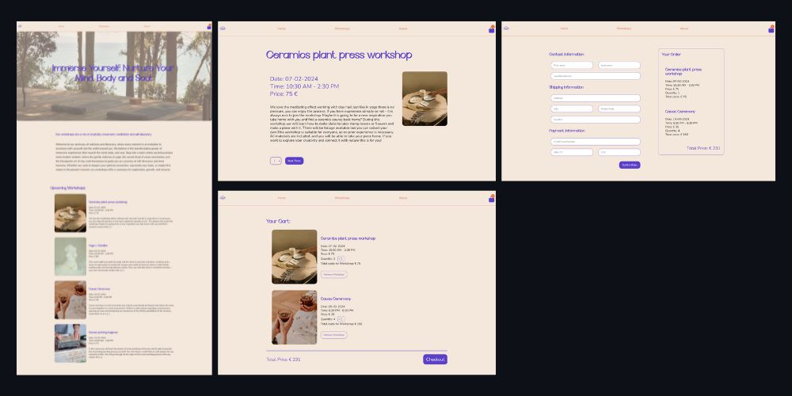

<h1>Next.js ecommerce store</h1>

<h2>About this project 📝</h2>
The ecommerce shop is an UpLeveled project, where I have to design and create a full stack ecommerce website using next.js.
Main features are:

- workshop page: here a user can find a list of all upcoming workshops
- single workshop page: when a product is clicked by the user it directs to this page, where description and detials can be found, the quantity can be edited and the item can be added to the cart
- cart page: shows all workshops added to the cart including their quantity (which can be edited), price, a delete button to delete an item from the cart, the total price of all the products in the cart and a checkout button
- checkout page: shows the total, an order summary and asks for shipping and payment information
- thank you page: after confirming the order, the user gets directed to the thank you page

<h2>Technologies ⚛️ </h2>

- javascript
- next.js
- react
- typescript
- sass
- postgres
- jest
- playwright

<h2>Screenshots 📷</h2>

<h3>Final Look </h3>
<p align="left">
  
</p>

<h3>Prototype on Figma</h3>

<p align="left">
  
</p>

<h2>Setup 💻</h2>

1. Clone the repository

```
git clone https://github.com/julessre/nextjs-ecommerce-store.git
cd next-ecommerce-store
```

2. Install dependencies using

```
pnpm install
```

3. Setup postgres database

Create a file called .env in the project root directory and paste the following, changing to your own username, password and database:

```
PGHOST=localhost
PGUSERNAME=<your username>
PGPASSWORD=<your password>
PGDATABASE=<your database>
```

4. Connect to postgres database and run either:

```
psql -U <user name> <database name> on windows and macOS
sudo -u <user name> psql -U <user name> <database name> on Linux
```

5. Run application

```
pnpm dev
```

Open http://localhost:3000 on browser
